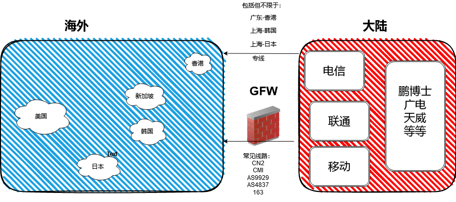

# 目标

找到离大陆最近最快的地方落脚，建立VPS，通过ssh连接到VPS，配合tmux连接官方的VPN。

看图说话

# 我的最优解
## 大陆部分
首先你最好有电信，联通或者移动的宽带。

其他网络运营商都是用的这三家任意一家的网络出国的。这会造成高峰期网络拥堵。

## 出国部分

众所周知，GFW限制了我们和世界的连接。为了绕靠GFW，走专线无疑是最好的选择。

专线费用非常贵，好在有一家主机厂商提供了按流量付费的广东-香港的专线，南方的同学可以考虑一下。

1. 通过 [该链接](https://idc.wiki/lndex.php?productid=1622) 注册账号。

2. 然后通过[该链接](https://idc.wiki/exnetwork.php) 购买IPLC转发节点，把你的SSH流量从国内走专线转发到国外的VPS上。

实测我整个OSCP考试下来，转发的流量包括了视频监控和SSH,一共也就一两块钱的流量。

北方的同学也可以用，就是延迟会高一点，也可以自己找找上海北京出口的专线。

## 落地部分

落地就要选择VPS，那必然首推vultr(https://www.vultr.com/?ref=8962537-8H),vultr 有其他厂商无可比拟的优势：
1. 支持自定义ISO安装。我们可以上传Kali的ISO 安装Kali Linux。
2. 节点多，比如 韩国，日本，新加坡都是离中国很近的机房。
3. 支持快照(Snapshots)和按小时收费。比如我们装好了一台Kali的VPS，当我们要去睡觉或者不用的时候就可以建一个快照,然后就可以把VPS删除了，等下次要用的时候再通过快照创建VPS。快照按月收费，费用$0.05/GB 每月，几乎可以忽略。

现在点击 连接(https://www.vultr.com/?ref=8962537-8H) 注册，充值还送100刀。

选择离你最近的机房，比如你在中国北方，日本和韩国机房可能是比较快的。

如果你在中国南方，香港和新加坡机房可能是比较快的。

vultr没有香港机房，但是还有一家卖香港VPS的主机商，也可以装KALI。但是要发工单给你挂载ISO。
而且是按月收费。如果你打算买这家，点击这个链接注册(https://www.hosuyun.com/aff/ZOCSBPVR)。购买前先发工单问一下给不给挂载Kali哈。我买的时候是2核2G 20M带宽，一个月三十多，可以装KALI。

VPS的配置建议最低 **2核2G10M** 带宽起步。

# 总结

通过ssh 走专线 连接到专线出口最近的VPS，配合 tmux 命令完成考试相关的操作，比如登录VPN，扫描，渗透测试等等。

有了稳定的ssh，就可以做任何考试相关的事啦。

*感谢你看到现在，如果想支持一下我辛苦的码字，请点击文章里的连接注册吧。*